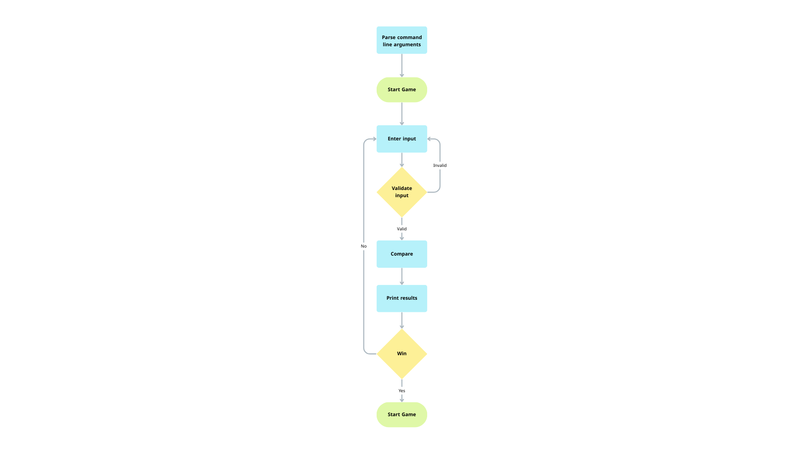

# MastermindGame 🎯

A simple C# console implementation of the classic **Mastermind** game.

## 🎮 Game Overview

In this game, the player must guess a secret 4-digit code. After each guess, the game provides feedback:
- **Well placed**: Correct digit in the correct position.
- **Misplaced**: Correct digit but in the wrong position.

The game continues until the player correctly guesses the code or runs out of attempts.

## 🧠 Game Rules

- Each code is a 4-digit number.
- Digits may be **repeated** (unless validation rules restrict that).
- Only numeric input is accepted.
- Feedback is given after each guess.

---

## ⚙️ How to Play

You can run the program from the terminal using the following arguments:

```bash
dotnet run -- -c 0123 -t 5

-c: (Optional) Secret code to be guessed.
-t: (Optional) Maximum number of attempts. Default is 10.
```

## 💡 Example Output

```bash
Can you break the code?
Enter a valid guess
Round 0
> 1456
Well placed pieces: 0
Misplaced pieces: 1

Round 1
> 4132
Well placed pieces: 1
Misplaced pieces: 2

Round 2
> 0123
Congratz! You did it!
```
## 🧾 Project Structure
```bash
MastermindGame_Asaad/
│
├── Program.cs           // Entry point
├── CoreGame.cs          // Core game loop and logic
├── SecretCode.cs        // Handles code generation and comparison
├── InputValidator.cs    // Validates player input
├── Display.cs           // Handles UI messages and display
├── README.md

```
## 📊 Flow Diagram
The following flowchart outlines how the player input is handled from start to finish:


## 👨‍💻 Author
**Asaad Saeed Turkai** – Game Developer & Software Engineer  
🔗 [LinkedIn](https://www.linkedin.com/in/asaadturkay/) • GitHub: `@Asaadstq`

